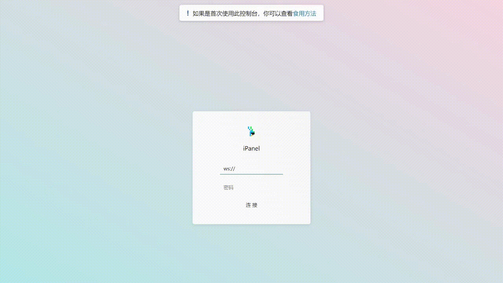
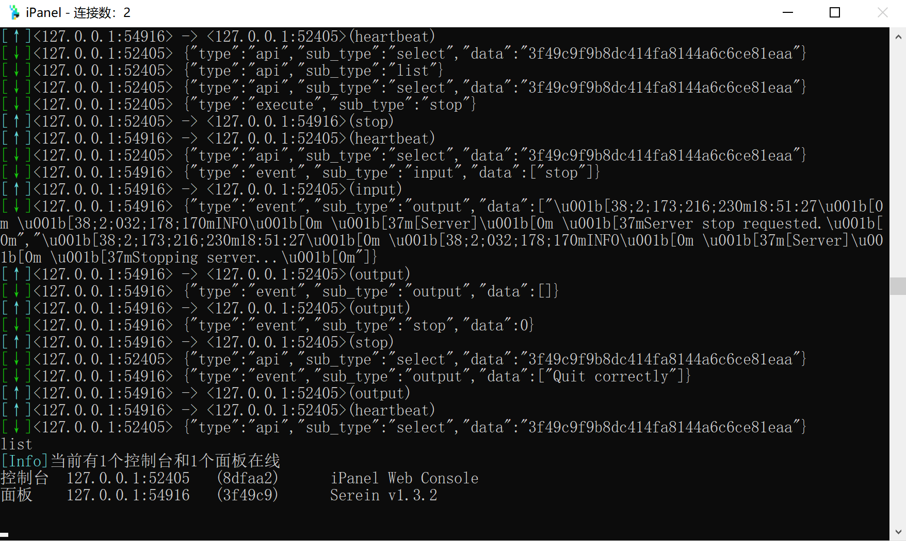

iPanel，一款适用于[Serein](https://serein.cc)的JavaScript插件，提供原汁原味的远程控制台、基本的服务器控制和系统信息监视等体验

>[!NOTE] 以后可能将考虑制作适用于LiteLoader或其他服务端加载器的版本

## 功能

- [x] 快捷开/关/重启/强制结束服务器
- [x] 命令交互
- [x] 监视系统信息

## 优点

- 易用
  - 不需要太多的网络安全知识
  - 开箱即食，没有繁琐的配置项
- 美观
  - 精美的页面，且支持暗黑模式
- 高性能
  - 即使后台疯狂刷屏也不会导致`iPanel`崩溃
  - 低占用，一般情况下内存占用<50MB
- 安全
  - 自动拒绝无效的会话，防止发送异常数据包导致崩溃

---

