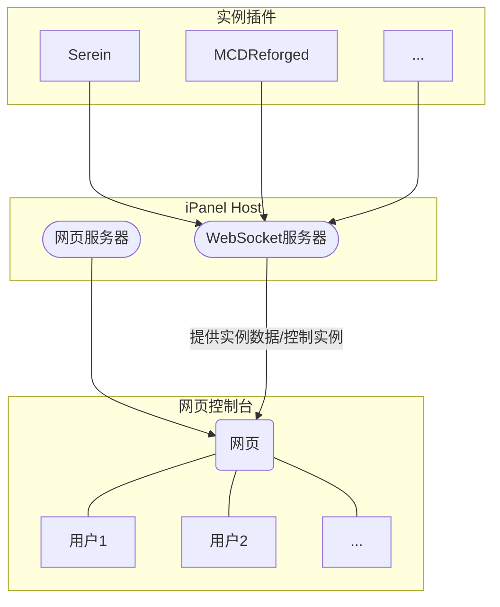

  
   
  <b>iPanel</b>
   
   
  适用于<a href="https://serein.cc/">Serein</a>等软件的网页版控制台插件
   
   
  
  
  

## 演示

## 支持的软件

- [x] [Serein](https://serein.cc/)
- [ ] [MCDReforged](https://github.com/Fallen-Breath/MCDReforged)
- [ ] ...

## 快速上手&使用方法

<https://ipanel.serein.cc/>

## 项目原理

## Stars记录

