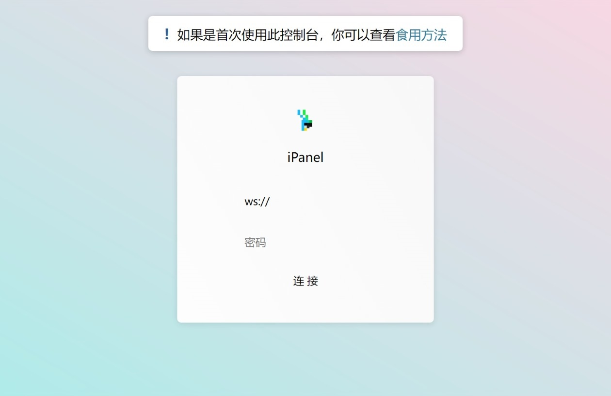
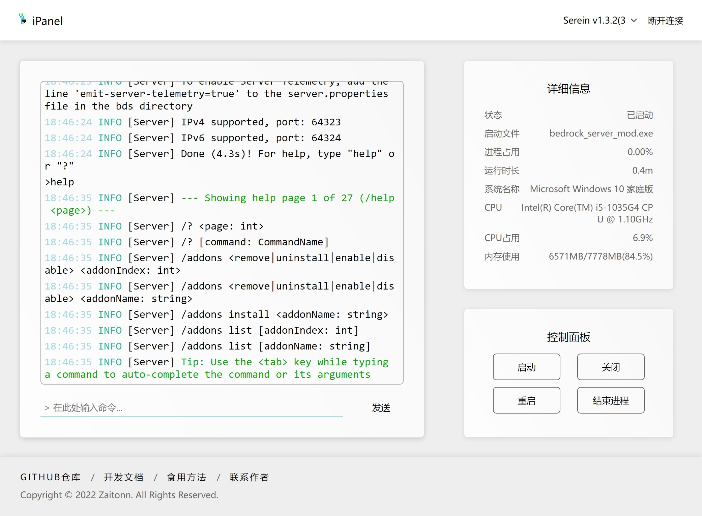
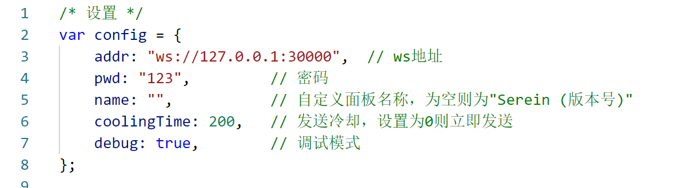

## 太长不看版

1. 从[Releases](https://github.com/Zaitonn/iPanel/releases/latest)页面下载最新版
2. 解压并运行iPanel.exe
3. 打开配置文件修改密码并保存
4. 将插件复制到Serein同目录的`plugins`文件夹下
5. 右键编辑插件文件修改密码，使之与第四步中一致
6. 在插件管理页面右键选择重新加载插件
7. 再次双击运行iPanel.exe
8. 在本地防火墙和服务商开放端口
   - 类型：TCP
9. 打开<http://ipanel.serein.cc/>

## 详细版

1. ~~打开电脑~~
2. 打开[Releases](https://github.com/Zaitonn/iPanel/releases/latest)页面
3. 点击下方的`Assets`下载最新版
4. 解压到你喜欢的文件夹
5. 进入该文件夹
6. 双击运行iPanel.exe
7. 打开配置文件修改密码并保存
   - 你可以选择使用记事本或Visual Studio等其他文本编辑器打开
   - 密码支持任意字符，但不可为空
   - 地址默认为`ws://0.0.0.0:30000`，若不存在端口冲突不必修改
8. 将`iPanel for Serein.js`插件复制到Serein同目录的`plugins`文件夹下
9. 右键编辑插件文件修改密码，使之与第6步中一致
   - 你可以选择使用记事本或Visual Studio等其他文本编辑器打开
   
   >[!WARNING]此处密码仅供参考，建议设置6位以上大小写数字组合的密码。**切勿设置和上图一样简单的密码**，密码泄露造成的后果自负:)
10. 在插件管理页面右键选择重新加载插件
11. 再次双击运行iPanel.exe
12. 在本地防火墙和服务商开放端口
       - 类型：TCP
       - 端口：与第6步中一致
13. 打开<http://ipanel.serein.cc/>，输入ip地址和密码，如果不出意外的话就能看到网页版控制台了
       - 此处填写的是外部端口，**不一定是第6步中的端口**
